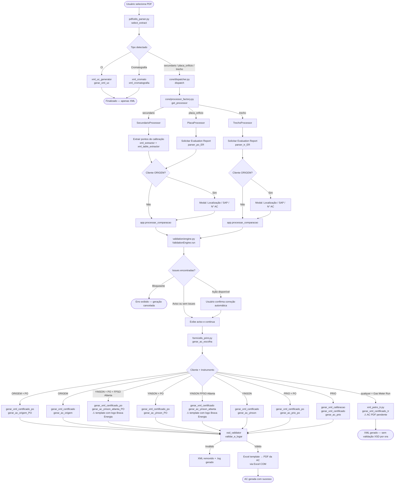
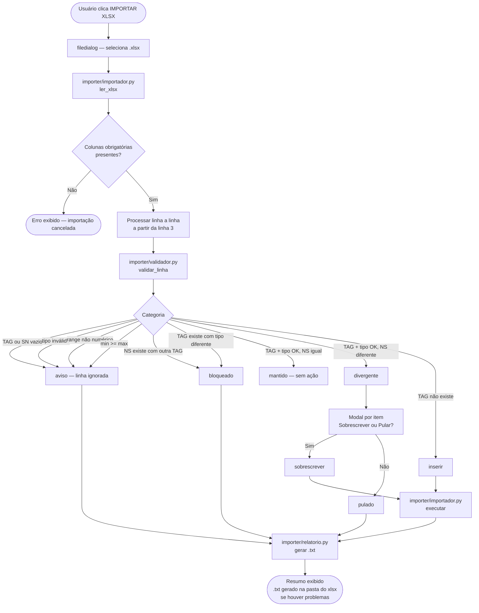
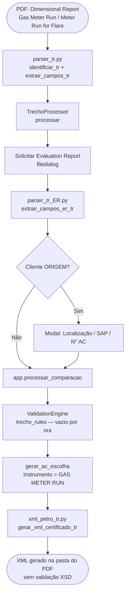
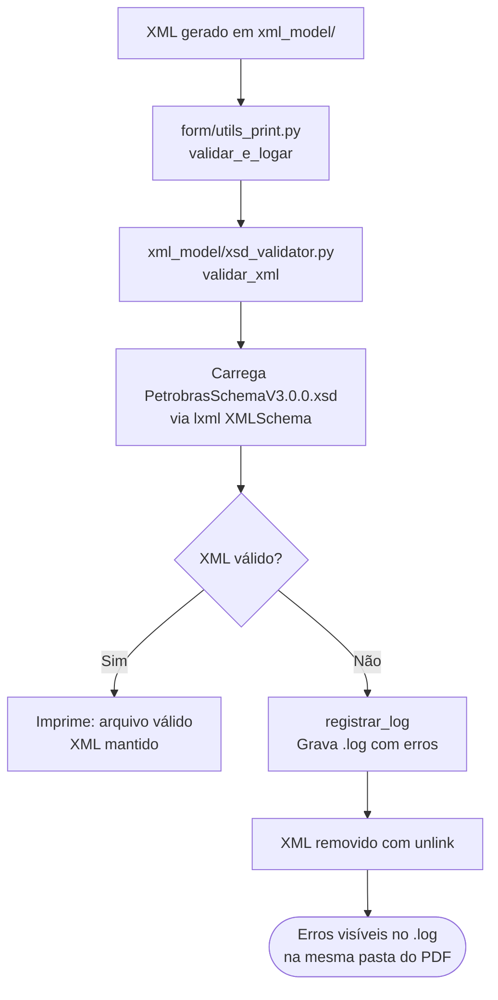

# AC's Generator — Documentação do Projeto

## Visão Geral

O **AC's Generator** é uma aplicação desktop (Windows) que automatiza a geração de **Análises Críticas (ACs)** de calibração de instrumentos de medição para clientes como PRIO, ORIGEM Energia, YINSON e SBM. A partir de um PDF de certificado de calibração, o sistema extrai os dados, valida as informações contra o banco de dados e os schemas XSD, e gera os arquivos finais (XML Petrobras + PDF da AC).

---

## Estrutura de Pastas

```
AC's_app/
│
├── Ac_app.py                   # Entry point
│
├── core/                       # Orquestração
│   ├── dispatcher.py           # Roteia tipo → processor
│   └── processor_factory.py    # Factory de processors
│
├── gui/                        # Interface gráfica (CustomTkinter)
│   └── interface.py            # Janela principal + lógica de fluxo
│
├── pdf/                        # Extração de dados dos PDFs
│   ├── utils_parser.py         # Detector de tipo de certificado
│   ├── parser_certificados.py  # Parser pressão/temperatura
│   ├── parser_po.py            # Parser placa de orifício
│   ├── parser_po_ER.py         # Parser evaluation report (PO)
│   ├── parser_tr.py            # Parser Gas Meter Run / Meter Run for Flare (DIM report)
│   ├── parser_tr_ER.py         # Parser evaluation report (trecho reto)
│   ├── parser_UC.py            # Parser relatório de incerteza (CI)
│   └── parser_sgs.py           # Parser cromatografia SGS
│
├── processors/                 # Lógica de processamento por tipo
│   ├── base_processor.py       # Classe abstrata base
│   ├── secundario_processor.py # Instrumentos PT / TT / DPT / TE
│   ├── placa_processor.py      # Placa de orifício
│   ├── trecho_processor.py     # Gas Meter Run / Trecho Reto
│   └── ci_processor.py         # Relatório de incerteza (CI)
│
├── validation/                 # Motor de validação
│   ├── engine.py               # Orquestrador de regras
│   ├── context.py              # Dados de contexto da validação
│   ├── issue.py                # Classe de ocorrência (aviso/bloqueio)
│   ├── rules_sec.py            # Regras instrumentos secundários (13 regras)
│   └── rules_po.py             # Regras placa de orifício (2 regras)
│
├── xml_model/                  # Geração e validação de XML
│   ├── xsd_validator.py        # Validação contra o schema Petrobras
│   ├── PetrobrasSchemaV3.0.0.xsd
│   ├── xml_petro_generator.py  # XML Petrobras principal (funções auxiliares)
│   ├── xml_generator.py        # XML calibração PRIO padrão
│   ├── xml_petro_po.py         # XML placa de orifício
│   ├── xml_petro_tr.py         # XML Gas Meter Run / Trecho Reto
│   ├── xml_uc_generator.py     # XML relatório de incerteza
│   ├── xml_cromato.py          # XML cromatografia
│   ├── xml_extractor.py        # Extração de pontos de calibração do PDF
│   ├── xml_extractor_PO.py     # Extração de medições PO
│   ├── xml_extractor_TR.py     # Extração de tabelas DIM report (trecho reto)
│   └── xml_table_extractor.py  # Extração de tabelas Petrobras
│
├── form/                       # Geração do PDF da AC (Excel → PDF)
│   ├── utils_print.py          # Roteador principal (gerar_ac_escolha)
│   ├── utils_print_ORIGEM.py
│   ├── utils_print_ORIGEM_PO.py
│   ├── utils_print_PRIO.py
│   ├── utils_print_PRIO_PO.py
│   ├── utils_print_YINSON.py
│   ├── utils_print_YINSON_ATLANTA.py
│   ├── utils_print_YINSON_PO.py
│   └── utils_print_YINSON_ATLANTA_PO.py
│
├── data/                       # Banco de dados SQLite
│   ├── conexao.py              # Conexão, criar_tabela(), migrar()
│   └── utils_db.py             # CRUD: instrumentos secundários e placas
│
├── importer/                   # Importação em lote via xlsx
│   ├── __init__.py
│   ├── validador.py            # Regras de validação por linha
│   ├── importador.py           # Orquestra leitura, validação e escrita no banco
│   └── relatorio.py            # Gera .txt com bloqueados, ignorados e pulados
│
└── logo/                       # Recursos de imagem
```

---

## Fluxo Principal — PDF → AC + XML



---

## Fluxo de Importação em Lote — xlsx → Banco de Dados

Acessível pelo botão **IMPORTAR XLSX** na tela "Editar Dados Técnicos".



### Regras de validação por linha

| Categoria | Condição | Ação |
|---|---|---|
| `aviso` | TAG ou SN vazio | Linha ignorada, registrada no .txt |
| `aviso` | `tipo` ausente ou diferente de `SEC`/`PO` | Linha ignorada, registrada no .txt |
| `aviso` | `min_range` ou `max_range` não numérico (só SEC) | Linha ignorada, registrada no .txt |
| `aviso` | `min_range >= max_range` (só SEC) | Linha ignorada, registrada no .txt |
| `bloqueado` | TAG existe no banco com tipo diferente | Não importa, registrado no .txt |
| `bloqueado` | NS existe com outra TAG | Não importa, registrado no .txt |
| `mantido` | TAG + NS + tipo idênticos no banco | Nenhuma ação |
| `divergente` | TAG + tipo iguais, NS diferente | Modal de confirmação por item |
| `inserir` | TAG não existe no banco | Inserção automática |

### Estrutura esperada do xlsx

| Coluna | Obrigatório | Observação |
|---|---|---|
| `tag` | ✅ | Identificador do instrumento |
| `sn_instrumento` | ✅ | Número de série |
| `tipo` | ✅ | `SEC` ou `PO` |
| `sn_sensor` | ➖ | Apenas SEC |
| `min_range` | ➖ | Apenas SEC |
| `max_range` | ➖ | Apenas SEC |

> Cabeçalho na **linha 1**, legenda opcional na **linha 2**, dados a partir da **linha 3**. Um template pré-formatado está disponível em `template_importacao_instrumentos.xlsx` na raiz do projeto.

---

## Fluxo Gas Meter Run — DIM Report + Evaluation Report



### Formatos de DIM Report suportados

| Formato | Cliente | Norma | Detecção |
|---|---|---|---|
| Gas Meter Run (padrão PRIO/ORIGEM) | PRIO, ORIGEM Energia | AGA3-2 / ISO 5167 | `"Meter Run"` ou `"Trecho Reto"` no texto |
| Meter Run for Flare Ultrasonic | SBM (Single Buoy Moorings INC.) | ISO 17089-2 | `"Meter Run for Flare"` → seção `meter_run_for_flare_ultrasonic` |

### Regras de extração — parser_tr.py

| Campo | Padrão reconhecido |
|---|---|
| TAG do sistema | `Identification / identificação: TAG` ou `Identification TAG/SN / Identificação TAG/NS: TAG / SN` |
| Nome do cliente | `Name / Nome: ... Contact / Contato:` (com ou sem espaços ao redor da `/`) |
| Material | `Material of Pipe / ...: Carbon Steel` ou `Material: Stainless Steel` |
| Norma | AGA3 → `AGA3-2:YEAR`; ISO 17089 → `ISO 17089-2:YEAR`; ISO 5167 → `ISO 5167-2:YEAR`; default `ISO 5167-2:2022` |
| Diâmetro nominal | `Nominal Diameter: 2"` → unidade `"` ; `Diameter / Diâmetro: 742,2 mm` → unidade `mm` |
| Data de medição | `Measurement Date: DD/MM/YYYY` ou `Calibration Date: DD/MM/YYYY` |
| Procedimento | Detecta AGA 3 ou ISO (`\d+`) no texto de medições |
| Condicionador de fluxo | `Zanker TAG / SN: N/A` ou `Não consta` → `"Nenhum"`; `19 tubos` → `"19 tubos"` |
| Componentes (TAG/SN) | Orifice Carrier, Upstream/Downstream Pipe, Zanker/19-Tube Bundle; `N/A` como TAG → `"NI"`; ausente completo → `tag="NI"`, `sn="NI"` |

### Extração DIM Report — xml_extractor_TR.py

O extrator lê as tabelas do PDF dimensional e organiza os dados por seção:

| Seção detectada | Chave interna | Dados extraídos |
|---|---|---|
| `Orifice Carrier` / `Porta Placa` | `porta_placa` | Diâmetros D (exceto cilindricidade e 2D/4D) |
| `Orifice Flange` / `Flange de Orifício` | `flange_de_orificio` | Diâmetro interno a 20°C |
| `Meter Run for Flare` / `Trecho Reto para Medidor` | `meter_run_for_flare_ultrasonic` | `Medium Internal Pipe Diameter (D) at 20°C` |

---

## Como Adicionar um Novo Instrumento

```mermaid
flowchart TD
    START([Novo tipo de instrumento]) --> P1

    P1["1. pdf/utils_parser.py\nAdicionar detecção do tipo\nem select_extract()\nRetornar novo tipo ex: 'flow_meter'"]
    P1 --> P2

    P2["2. pdf/parser_NOVOTIPO.py\nCriar módulo de extração\ncom extrair_campos_novotipo()"]
    P2 --> P3

    P3["3. processors/novotipo_processor.py\nCriar classe estendendo BaseProcessor\nImplementar processar(caminho, dados)"]
    P3 --> P4

    P4["4. core/processor_factory.py\nRegistrar novo processor no dict\n'flow_meter': FlowMeterProcessor(app)\nImportar a classe"]
    P4 --> P5

    P5["5. validation/rules_novotipo.py\nCriar funções de regra\nRetornar ValidationIssue ou None"]
    P5 --> P6

    P6["6. validation/engine.py\nRegistrar as novas regras\nno bloco correspondente ao tipo"]
    P6 --> P7

    P7["7. xml_model/xml_novotipo.py\nCriar gerador de XML\nBaseado no schema Petrobras"]
    P7 --> P8

    P8["8. form/utils_print_NOVOTIPO.py\nCriar gerador de AC\nCarregar template Excel, preencher células,\nexportar PDF via Excel COM"]
    P8 --> P9

    P9["9. form/utils_print.py — gerar_ac_escolha()\nAdicionar elif com condição\ncliente + instrumento → chamar novo gerador"]
    P9 --> P10

    P10["10. TemplateAC_NOVOTIPO.xlsx\nCriar template Excel com\nlayout da AC do novo tipo"]
    P10 --> P11

    P11["11. main.spec\nSe necessário, incluir novos\narquivos de dados no build"]

    P11 --> END([Novo instrumento integrado])
```



---

## Fluxo de Validação XSD



> **Nota:** O fluxo de Gas Meter Run ainda não passa pela validação XSD — o XML é gerado diretamente para testes.

### Enumerações do schema (PetrobrasSchemaV3.0.0.xsd)

#### `t_lista_componente` — valores válidos para `<TIPO>` em `DEMAIS_COMPONENTES`

| Valor no XML | Quando usar |
|---|---|
| `PORTA PLACA` | Orifice Carrier padrão |
| `FLANGE DE ORIFICIO` | Orifice Flange (sem Orifice Carrier) |
| `CONDICIONADOR DE FLUXO` | Zanker ou 19-tube bundle |
| `TRECHO RETO PARA MEDIDOR DE FLARE ULTRASSÔNICO` | Meter Run for Flare Ultrasonic (SBM) |
| `TRECHO A MONTANTE 1` | Upstream Pipe 1 |
| `TRECHO A MONTANTE 2` | Upstream Pipe 2 |
| `TRECHO A JUSANTE` | Downstream Pipe |

#### `t_norma` — valores válidos para `<NORMA_AVALIACAO>`

| Valor | Uso |
|---|---|
| `AGA3-2:1991` / `AGA3-2:2000` / `AGA3-2:2016` | Gas Meter Run com norma AGA |
| `ISO 5167-2:2022` | Gas Meter Run padrão (PRIO/ORIGEM) |
| `ABNT NBR ISO 5167-2:2022` | Variante ABNT |
| `ISO 17089-2:2010` | Meter Run for Flare Ultrasonic (SBM) |

---

## Regras de Validação — Instrumentos Secundários

| Regra | O que verifica |
|---|---|
| `regra_tag_vs_sn` | Divergência entre TAG e SN (detecção MVS) |
| `regra_novo_instrumento` | Instrumento não cadastrado → oferta de inserção automática |
| `regra_sn_instrumento` | SN do instrumento difere do cadastro |
| `regra_sn_sensor` | SN do sensor difere do cadastro |
| `regra_range` | Faixa de calibração difere do cadastro |
| `regra_haste_te` | Validação de haste do sensor TE |
| `regra_local_fpso` | Localização FPSO inconsistente |
| `regra_rangein` | Range indicado vs range de calibração |
| `regra_incert_fidu` | Incerteza / erro fiducial fora do limite |
| `regra_cmc` | CMC (Capability Measurement Capability) |
| `regra_classe` | Classe do instrumento |
| `data_proxcal` | Data da próxima calibração |
| `prazo_emissao` | Prazo de emissão do certificado |

---

## Clientes e Templates Suportados

| Cliente | Instrumento | Template Excel | Gerador XML | AC PDF |
|---|---|---|---|---|
| ORIGEM Energia Alagoas | Secundário | `TemplateAC_ORIGEM.xlsx` | `xml_petro_generator.py` | ✅ |
| ORIGEM Energia Alagoas | Placa de Orifício | `TemplateAC_PO_ORIGEM.xlsx` | `xml_petro_po.py` | ✅ |
| PRIO | Secundário | `TemplateAC_PRIO.xlsx` | `xml_generator.py` + `xml_petro_generator.py` | ✅ |
| PRIO | Placa de Orifício | `TemplateAC_PO_PRIO.xlsx` | `xml_petro_po.py` | ✅ |
| PRIO | Gas Meter Run | — | `xml_petro_tr.py` | ⏳ pendente |
| YINSON | Secundário | `TemplateAC_YINSON.xlsx` | `xml_petro_generator.py` | ✅ |
| YINSON (FPSO Atlanta) | Secundário | `TemplateAC_YINSON - ATLANTA.xlsx` ¹ | `xml_petro_generator.py` | ✅ |
| YINSON | Placa de Orifício | `TemplateAC_PO_YINSON.xlsx` | `xml_petro_po.py` | ✅ |
| YINSON (FPSO Atlanta) | Placa de Orifício | `TemplateAC_PO_YINSON - ATLANTA.xlsx` ¹ | `xml_petro_po.py` | ✅ |
| SBM (Single Buoy Moorings INC.) | Gas Meter Run (Meter Run for Flare) | — | `xml_petro_tr.py` | ⏳ pendente |

> ¹ Os templates **FPSO Atlanta** incluem o logo da **Brava Energia**, exigido contratualmente para instrumentos localizados nessa unidade. O roteador (`gerar_ac_escolha`) verifica `"ATLANTA" in local` antes de despachar para o template padrão YINSON.

> O roteamento para Gas Meter Run é feito **exclusivamente pelo instrumento** (`instrumento == "GAS METER RUN"`), independentemente do cliente — o que permite suportar qualquer cliente que envie este tipo de relatório.

---

## Banco de Dados — Tabela `instrumentos`

| Coluna | Tipo | Obrigatório | Descrição |
|---|---|---|---|
| `id` | INTEGER | ✅ | Chave primária autoincremental |
| `tag` | TEXT | ✅ | Identificador do instrumento |
| `sn_instrumento` | TEXT | ✅ | Número de série do instrumento ou placa |
| `sn_sensor` | TEXT | ➖ | Número de série do sensor (só SEC) |
| `min_range` | REAL | ➖ | Faixa mínima de calibração (só SEC) |
| `max_range` | REAL | ➖ | Faixa máxima de calibração (só SEC) |
| `tipo` | TEXT | ✅ | `SEC` (secundário) ou `PO` (placa de orifício) |

A função `migrar()` em `data/conexao.py` é chamada na inicialização e aplica automaticamente:
- Adição da coluna `tipo` em bancos criados antes desta versão
- Conversão de valores legados: `'secundario'` → `'SEC'` e `'placa_orificio'` → `'PO'`

---

## Comportamentos Conhecidos / Limitações

### pdfplumber — fusão de colunas em PDFs multi-coluna

Em certificados com layout de duas colunas lado a lado (ex: certificados TEM), o pdfplumber pode mesclar o texto de colunas adjacentes, gerando strings como `Ca4lTibBrMat2iGon1 Range:` em vez de `Calibration Range:`. O `parser_certificados.py` possui um fallback que ancora no padrão `Range: Min: X - Max: Y` para contornar esse problema.

Se um novo certificado apresentar campos ausentes (`"None"` no XML), verificar o texto extraído com:

```python
import pdfplumber
with pdfplumber.open("certificado.pdf") as pdf:
    for i, page in enumerate(pdf.pages):
        print(f"=== Página {i} ===")
        print(repr(page.extract_text()))
```

### Número de CI com sufixo REV

O parser `parser_UC.py` reconhece o sufixo de revisão no número do CI:

```
CI-1600.0000-6252-813-O2C-357_REV.01   ✅ reconhecido
CI-1600.0000-6252-813-O2C-357.REV.01   ✅ reconhecido
CI-1600.0000-6252-813-O2C-357          ✅ reconhecido (sem REV)
```

### Componentes ausentes no trecho reto

Quando `TAG / SN: Não consta` (ou `N/A`, `Not present`, `N/C`) sem nenhum SN válido a seguir, o componente aparece no XML com `tag="NI"` e `sn="NI"` — **não é omitido**. Isso força a revisão manual do caso em vez de silenciar o problema.

A distinção entre `N/A / TR00434-01 M1` (TAG ausente mas SN presente) e `N/A` simples é feita por lookahead: `(?!\s*/\s*[A-Z0-9])`.

---

## Dependências Principais

| Biblioteca | Uso |
|---|---|
| `customtkinter` | Interface gráfica |
| `openpyxl` | Leitura e escrita de templates Excel |
| `win32com.client` | Exportação Excel → PDF via COM |
| `lxml` | Geração e validação de XML / XSD |
| `pdfplumber` / `pymupdf` | Extração de texto e tabelas de PDF |
| `sqlite3` | Banco de dados de instrumentos |
| `holidays` | Cálculo de dias úteis |
| `PyInstaller` | Empacotamento do executável |

---

## Arquitetura Futura

A interface atual (CustomTkinter) pode ser substituída por um frontend web moderno sem abrir mão da instalação local. A abordagem recomendada:

1. **Backend**: expor a lógica Python via **FastAPI** (servidor local, porta `127.0.0.1:PORT`)
2. **Frontend**: qualquer tecnologia web (React, Vue, etc.) servida como arquivos estáticos pelo próprio FastAPI
3. **Janela desktop**: **PyWebView** abre o frontend em uma janela nativa sem navegador externo
4. **Empacotamento**: PyInstaller empacota Python + FastAPI + arquivos estáticos em um único instalador `.exe`

O usuário instala normalmente; a "API" roda localmente no computador dele — sem necessidade de servidor externo.
