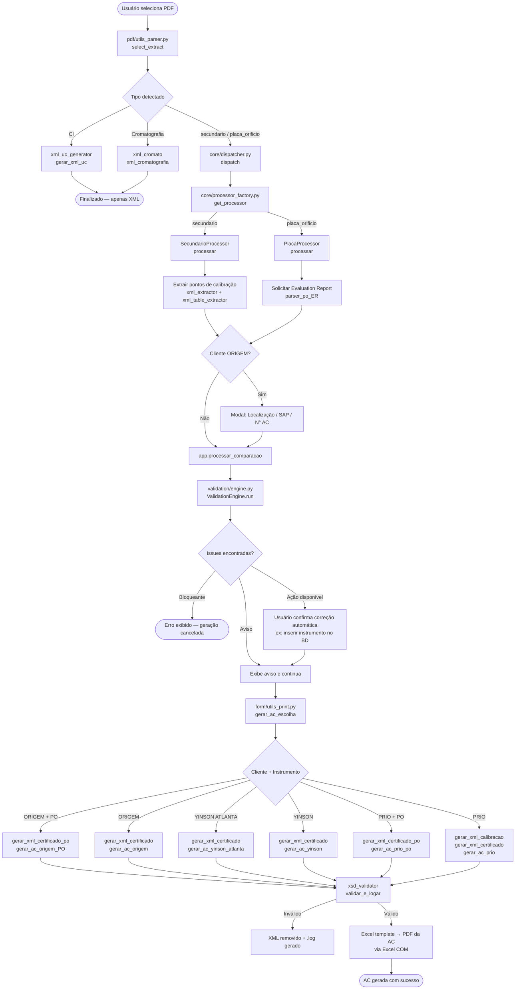

# AC's Generator — Documentação do Projeto

## Visão Geral

O **AC's Generator** é uma aplicação desktop (Windows) que automatiza a geração de **Análises Críticas (ACs)** de calibração de instrumentos de medição para clientes como PRIO, ORIGEM Energia e YINSON. A partir de um PDF de certificado de calibração, o sistema extrai os dados, valida as informações contra o banco de dados e os schemas XSD, e gera os arquivos finais (XML Petrobras + PDF da AC).

---

## Estrutura de Pastas

```
AC's_app/
│
├── Ac_app.py                   # Entry point
│
├── core/                       # Orquestração
│   ├── dispatcher.py           # Roteia tipo → processor
│   └── processor_factory.py    # Factory de processors
│
├── gui/                        # Interface gráfica (CustomTkinter)
│   └── interface.py            # Janela principal + lógica de fluxo
│
├── pdf/                        # Extração de dados dos PDFs
│   ├── utils_parser.py         # Detector de tipo de certificado
│   ├── parser_certificados.py  # Parser pressão/temperatura
│   ├── parser_po.py            # Parser placa de orifício
│   ├── parser_po_ER.py         # Parser evaluation report (PO)
│   ├── parser_UC.py            # Parser relatório de incerteza (CI)
│   └── parser_sgs.py           # Parser cromatografia SGS
│
├── processors/                 # Lógica de processamento por tipo
│   ├── base_processor.py       # Classe abstrata base
│   ├── secundario_processor.py # Instrumentos PT / TT / DPT / TE
│   ├── placa_processor.py      # Placa de orifício
│   └── ci_processor.py        # Relatório de incerteza (CI)
│
├── validation/                 # Motor de validação
│   ├── engine.py               # Orquestrador de regras
│   ├── context.py              # Dados de contexto da validação
│   ├── issue.py                # Classe de ocorrência (aviso/bloqueio)
│   ├── rules_sec.py            # Regras instrumentos secundários (13 regras)
│   └── rules_po.py             # Regras placa de orifício (2 regras)
│
├── xml_model/                  # Geração e validação de XML
│   ├── xsd_validator.py        # Validação contra o schema Petrobras
│   ├── PetrobrasSchemaV3.0.0.xsd
│   ├── xml_petro_generator.py  # XML Petrobras principal
│   ├── xml_generator.py        # XML calibração PRIO padrão
│   ├── xml_petro_po.py         # XML placa de orifício
│   ├── xml_uc_generator.py     # XML relatório de incerteza
│   ├── xml_cromato.py          # XML cromatografia
│   ├── xml_extractor.py        # Extração de pontos de calibração do PDF
│   ├── xml_extractor_PO.py     # Extração de medições PO
│   └── xml_table_extractor.py  # Extração de tabelas Petrobras
│
├── form/                       # Geração do PDF da AC (Excel → PDF)
│   ├── utils_print.py          # Roteador principal (gerar_ac_escolha)
│   ├── utils_print_ORIGEM.py
│   ├── utils_print_ORIGEM_PO.py
│   ├── utils_print_PRIO.py
│   ├── utils_print_PRIO_PO.py
│   ├── utils_print_YINSON.py
│   └── utils_print_YINSON_ATLANTA.py
│
├── data/                       # Banco de dados SQLite
│   ├── conexao.py
│   └── utils_db.py
│
└── logo/                       # Recursos de imagem
```

---

## Fluxo Principal — PDF → AC + XML



---

## Como Adicionar um Novo Instrumento

```mermaid
flowchart TD
    START([Novo tipo de instrumento]) --> P1

    P1["1. pdf/utils_parser.py\nAdicionar detecção do tipo\nem select_extract()\nRetornar novo tipo ex: 'flow_meter'"]
    P1 --> P2

    P2["2. pdf/parser_NOVOIPO.py\nCriar módulo de extração\ncom extrair_campos_novotipo()"]
    P2 --> P3

    P3["3. processors/novotipo_processor.py\nCriar classe estendendo BaseProcessor\nImplementar processar(caminho, dados)"]
    P3 --> P4

    P4["4. core/processor_factory.py\nRegistrar novo processor no dict\n'flow_meter': FlowMeterProcessor(app)\nImportar a classe"]
    P4 --> P5

    P5["5. validation/rules_novotipo.py\nCriar funções de regra\nRetornar ValidationIssue ou None"]
    P5 --> P6

    P6["6. validation/engine.py\nRegistrar as novas regras\nno bloco correspondente ao tipo"]
    P6 --> P7

    P7["7. xml_model/xml_novotipo.py\nCriar gerador de XML\nBaseado no schema Petrobras"]
    P7 --> P8

    P8["8. form/utils_print_NOVOTIPO.py\nCriar gerador de AC\nCarregar template Excel, preencher células,\nexportar PDF via Excel COM"]
    P8 --> P9

    P9["9. form/utils_print.py — gerar_ac_escolha()\nAdicionar elif com condição\ncliente + instrumento → chamar novo gerador"]
    P9 --> P10

    P10["10. TemplateAC_NOVOTIPO.xlsx\nCriar template Excel com\nlayout da AC do novo tipo"]
    P10 --> P11

    P11["11. main.spec\nSe necessário, incluir novos\narquivos de dados no build"]

    P11 --> END([Novo instrumento integrado])
```



---

## Fluxo de Validação XSD


---

## Regras de Validação — Instrumentos Secundários

| Regra | O que verifica |
|---|---|
| `regra_tag_vs_sn` | Divergência entre TAG e SN (detecção MVS) |
| `regra_novo_instrumento` | Instrumento não cadastrado → oferta de inserção automática |
| `regra_sn_instrumento` | SN do instrumento difere do cadastro |
| `regra_sn_sensor` | SN do sensor difere do cadastro |
| `regra_range` | Faixa de calibração difere do cadastro |
| `regra_haste_te` | Validação de haste do sensor TE |
| `regra_local_fpso` | Localização FPSO inconsistente |
| `regra_rangein` | Range indicado vs range de calibração |
| `regra_incert_fidu` | Incerteza / erro fiducial fora do limite |
| `regra_cmc` | CMC (Capability Measurement Capability) |
| `regra_classe` | Classe do instrumento |
| `data_proxcal` | Data da próxima calibração |
| `prazo_emissao` | Prazo de emissão do certificado |

---

## Clientes e Templates Suportados

| Cliente | Instrumento | Template Excel | Gerador XML |
|---|---|---|---|
| ORIGEM Energia Alagoas | Secundário | `TemplateAC_ORIGEM.xlsx` | `xml_petro_generator.py` |
| ORIGEM Energia Alagoas | Placa de Orifício | `TemplateAC_PO_ORIGEM.xlsx` | `xml_petro_po.py` |
| PRIO | Secundário | `TemplateAC_PRIO.xlsx` | `xml_generator.py` + `xml_petro_generator.py` |
| PRIO | Placa de Orifício | `TemplateAC_PO_PRIO.xlsx` | `xml_petro_po.py` |
| YINSON | Secundário | `TemplateAC_YINSON.xlsx` | `xml_petro_generator.py` |
| YINSON (FPSO Atlanta) | Secundário | `TemplateAC_YINSON - ATLANTA.xlsx` | `xml_petro_generator.py` |

---

## Dependências Principais

| Biblioteca | Uso |
|---|---|
| `customtkinter` | Interface gráfica |
| `openpyxl` | Leitura e escrita de templates Excel |
| `win32com.client` | Exportação Excel → PDF via COM |
| `lxml` | Geração e validação de XML / XSD |
| `pdfplumber` / `pymupdf` | Extração de texto e tabelas de PDF |
| `sqlite3` | Banco de dados de instrumentos |
| `holidays` | Cálculo de dias úteis |
| `PyInstaller` | Empacotamento do executável |
