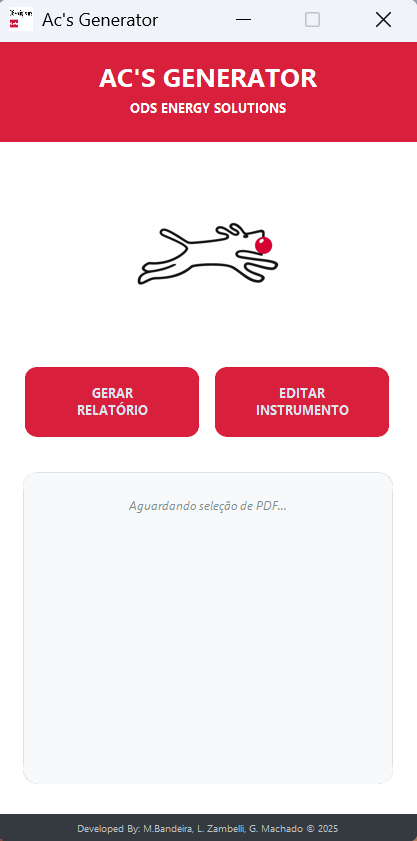

# 📄 AC's Generator – Gerador de Análises Críticas


Software desenvolvido para **analisar certificados de calibração (PDF)** de instrumentos de **pressão, temperatura e placa de orificio**, comparar com uma base local e gerar automaticamente:

- 📑 **Análise Crítica (AC) em PDF**
- 🧾 **Arquivo XML no padrão ODS**
- 🗄️ **Atualização automática do banco de dados local (SQLite)**

---

## ⚙️ Funcionalidades Principais

- 📄 Leitura automática do certificado em PDF  
- 🔎 Extração das seguintes informações:
  - TAG  
  - Número do certificado  
  - Datas  
  - Ranges  
  - SN do instrumento e do sensor  
  - Valores de calibração  
  - Erro fiducial  
  - Incerteza global  
  - Verificação da Aprovação de Placa de Orifício pelo Report Valuation

- 🗃️ Comparação automática com banco de dados SQLite  
- ⚠️ Verificação de divergências de:
  - TAG  
  - SN  
  - Range  
  - Diâmetro e comprimento da haste  
  - Localização  
  - Range de calibração e range indicado  
  - Erro fiducial e incerteza global (PT e DPT) 
  - CMC
  - Classificação (FISCAL, APROPRIAÇÃO, TRASNFERÊNCIA DE CUSTÓDIA, OPERACIONAL) - EXCLUSIVO CERTIFICADO PRIO
  - VALIDAÇÃO PRÓXIMA DATA DE CALIBRAÇÃO - EXCLUSIVO CERTIFICADO PRIO
  - VALIDAÇÃO DO PRAZO DE EMISSÃO DO CERTIFICADO DE ACORDO COM AS REGRAS DO CLIENTE.
  

- 🔄 Atualização automática do banco quando autorizada  
- ✍️ Atualização manual via interface gráfica  
- 📑 Geração automática da **Análise Crítica (PDF)**  (PRIO, ORIGEM, YINSON)
  - Utiliza o template `TemplateAC.xlsx`  
  - Exporta para PDF via Excel  

- 🧾 Geração automática do **XML**
  - Preenchimento do modelo XML com dados do certificado e do instrumento (PRIO E PETROBRAS)  

---

## 🧰 Suporte a Diferentes Tipos de Instrumentos

- PT / PIT  
- DPT  
- TT / TIT  
- Sensores TE  
- Placa de Orificio

---

## 📁 Estrutura dos Arquivos Necessários

```text
/AC_app
│── Ac_app.exe               → Executável
│── TemplateAC.xlsx          → Template para geração da AC
│── instrumentos.db          → Banco de dados local (SQLite)
│
├── pdf/                     → Módulos de extração de dados do PDF
├── validation/              → Regras de validação
├── xml_model/               → Gerador do XML
├── form/                    → Geração do PDF da AC
└── gui/                     → Interface gráfica (Tkinter)
```

▶️ Como usar



1-Abra o software (executável).
2-Clique em Selecionar Certificado PDF.
3-O programa:

- Lê o PDF
- Compara com o banco
- Exibe divergências

-Gera automaticamente:

    - AC.pdf
    - XML.xml

4-Os arquivos são salvos na mesma pasta do PDF original.

OBS: Para calibração malha aberta (TE e TT) executar primeiro a AC do TE para que o sistema grave o N° do certificado no XML do TT