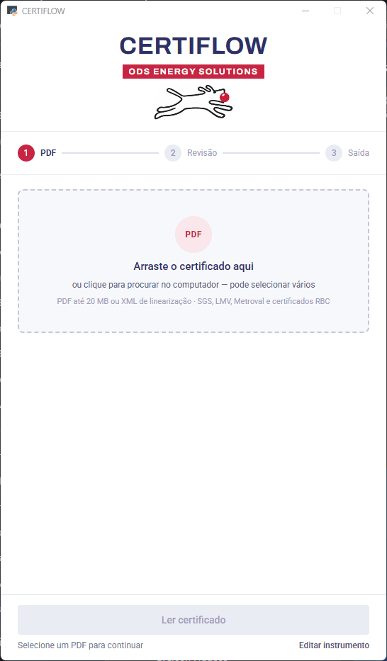

# 📄 CertiFlow — AC's Generator

Desktop application from ODS Metering Systems for generating instrument
calibration **Critical Analyses (AC)**, in compliance with ANP (Brazil's
National Petroleum Agency) rules. It reads the calibration certificate
in **PDF**, compares it against the local registry (SQLite), and
automatically generates:

- 📑 **AC (Critical Analysis) in PDF**
- 🧾 **XML in the ANP/client standard**
- 🗄️ **Update of the local instrument registry**

Interface built with **pywebview** (HTML/CSS/JS embedded in a native
Windows window) — no longer the old Tkinter GUI from previous versions.

---

## ⚙️ Main features

- 📄 Reading **one or several certificates at a time** (batch mode): the
  queue reads everything first, then shows a single screen with the
  pending divergences for each instrument, and generates all the ready
  ACs at once.
- 🔎 Automatic extraction of TAG, certificate number, dates, ranges,
  instrument/sensor SN, calibration points, fiducial error,
  uncertainty, among others — according to the identified document
  type.
- 🗃️ Comparison against the registry (SQLite) and divergence checking:
  - TAG, SN (instrument/sensor), Range, indicated range vs. calibrated
    range
  - Stem diameter and length (TE), Location (FPSO/client)
  - Fiducial error and uncertainty (including against the applicable
    CMC)
  - Classification (Fiscal/Appropriation/Custody Transfer/Operational)
    and issuance deadline — client-specific rules
- ✍️ Interactive divergence resolution: apply the correction to the
  registry, keep/ignore it, or skip the certificate when no correction
  is possible (e.g., uncertainty below the CMC) — in batch, without
  locking the queue or stopping on the remaining certificates.
- 📑 Generation of the **AC in PDF** from `.xlsx` templates (filled in
  via openpyxl, exported to PDF via Excel COM automation — reuses a
  single Excel instance for the whole batch).
- 🧾 Generation of the **XML** in the corresponding ANP/client standard.
- 🧪 **Chromatography** reports (SGS or Origem Energia Alagoas's
  in-house lab) and **uncertainty calculation (CI)** reports: generate
  the XML directly, without going through the review screen.
- 🖊️ Manual instrument registration/editing through the interface.
- 📤📥 Bulk registry import/export via `.xlsx`.
- 🖱️ Drag and drop files straight onto the screen (stored in a permanent
  folder under Documents).

---

## 🏭 Supported clients and instrument types

**Clients (AC/XML generation):** PRIO, YINSON, YINSON ATLANTA, ORIGEM
ENERGIA ALAGOAS S.A. — each with its own AC template and, for orifice
plates, its own variant (PO).

**Instrument/document types:**
- PT / PIT, DPT, TT / TIT, TE sensors (with automatic TE ↔ TT/TIT
  linking by TAG pair)
- Analog/digital pressure gauges (including differential and absolute)
- PT-100 RTDs, thermometers, temperature transmitters
- Orifice plate
- Straight run / Gas Meter Run (generates the dimensional XML; AC in
  PDF not yet implemented for this type)
- Chromatography report (SGS or Origem Energia Alagoas)
- Uncertainty calculation (CI) report

---

## 📁 Project structure

```text
AC's_app/
│── Ac_app.py                 → Entry point (opens the pywebview window)
│── instrumentos.db           → Local database (SQLite)
│── TemplateAC_*.xlsx         → AC templates per client/variant
│
├── webui/                    → Front-end (HTML/CSS/JS) — CertiFlow screens
├── gui/                      → Api (JS↔Python bridge) and services (reading,
│                                review, import/export)
├── pdf/                      → Data extraction from PDFs by document type
├── validation/                → Validation rules engine (divergences)
├── xml_model/                 → XML generation (ANP/petro/PO/TR/chromato/CI)
├── form/                      → Excel template filling and export to PDF
├── processors/                → Routing by instrument type (Dispatcher)
└── data/                      → Database (SQLite) and file system access
```

---

## 🖥️ Screens



Certificate selection → reading → divergence review (single file and
aggregated batch) → generated files → instrument registration/editing.

---

## ▶️ How to run

Requires **Python 3.12**, **Microsoft Excel** installed (COM automation
is used to export the AC to PDF), and Windows's **WebView2 Runtime**
(already included by default on up-to-date Windows 10/11).

```powershell
python -m venv venv
venv\Scripts\pip install -r requirements.txt
venv\Scripts\python.exe Ac_app.py
```

> Always use the project's `venv` Python — a different globally
> installed pywebview version can silently break the file dialogs.

To generate the executable (`.exe`), the project already has an
`Ac_app.spec` file ready for PyInstaller.

---

## 🧭 Usage workflow

1. Open the app and click **Select PDF certificate(s)** (you can choose
   more than one — this automatically enables batch mode).
2. Click **Read certificate(s)**: the app extracts the data and
   compares it against the registry.
3. **Single certificate:** review the divergences (if any) and click
   **Generate report and XML**.
   **Batch:** all files are read first; at the end, an aggregated
   screen shows only the instruments with pending divergences —
   resolve each one (or skip the certificate) and click **Generate
   reports** to generate all the ones that are ready.
4. The files (AC in PDF + XML) are saved in the same folder as the
   original PDF.

> For open-loop calibration (TE + TT/TIT), read both certificates
> together (same batch or in sequence) — the system automatically
> links the TE certificate to the corresponding TT/TIT by TAG pair,
> regardless of the reading order.
