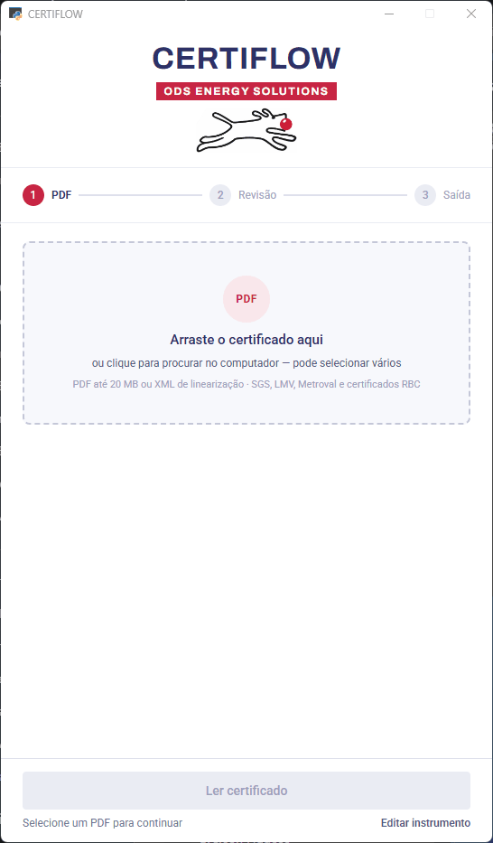

# 📄 CertiFlow — AC's Generator

Desktop application from ODS Metering Systems for generating instrument
calibration **Critical Analyses (AC)**, in compliance with ANP (Brazil's
National Petroleum Agency) rules. It reads the calibration certificate
in **PDF**, compares it against the local registry (SQLite), and
automatically generates:

- 📑 **AC (Critical Analysis) in PDF**
- 🧾 **XML in the ANP/client standard**
- 🗄️ **Update of the local instrument registry**

Interface built with **pywebview** (HTML/CSS/JS embedded in a native
Windows window) — no longer the old Tkinter GUI from previous versions.

---

## ⚙️ Main features

- 📄 Reading **one or several certificates at a time** (batch mode): the
  queue reads everything first, then shows a single screen with the
  pending divergences for each instrument, and generates all the ready
  ACs at once.
- 🔎 Automatic extraction of TAG, certificate number, dates, ranges,
  instrument/sensor SN, calibration points, fiducial error,
  uncertainty, among others — according to the identified document
  type.
- 🗃️ Comparison against the registry (SQLite) and divergence checking:
  - TAG, SN (instrument/sensor), Range, indicated range vs. calibrated
    range
  - Stem diameter and length (TE), Location (FPSO/client)
  - Fiducial error and uncertainty (including against the applicable
    CMC)
  - Classification (Fiscal/Appropriation/Custody Transfer/Operational)
    and issuance deadline — client-specific rules
- ✍️ Interactive divergence resolution: apply the correction to the
  registry, keep/ignore it, or skip the certificate when no correction
  is possible (e.g., uncertainty below the CMC) — in batch, without
  locking the queue or stopping on the remaining certificates.
- 📑 Generation of the **AC in PDF** from HTML/Jinja2 templates, rendered
  to PDF headlessly through the Windows **WebView2** runtime
  (`form/html_to_pdf.py`) — no Excel/COM automation involved anymore.
  A single WebView2 session is reused for every report of the same
  certificate/batch, instead of paying a full browser cold-start per
  file (measured ~25× faster than the previous per-report Excel COM
  pipeline).
- 🧾 Generation of the **XML** in the corresponding ANP/client standard.
- 🧪 **Chromatography** reports (SGS, Origem Energia Alagoas's in-house
  lab, GT Química or GT Technology) and **uncertainty calculation
  (CI)** reports: generate the XML directly, without going through the
  review screen.
- 🌀 **Flow meter Linearization and Presumed Failure** reports: reads
  the meter's external calibration XML and renders the report
  (K-Factor Corrected per point, average KF, alarm limits) straight to
  PDF; the K-Factor Corrected precision (significant figures) is
  configurable per certificate, since it depends on the flow computer
  actually programmed, not on the meter itself. A filled companion
  `.xlsx` (same layout as the original Excel template, generated via
  openpyxl only — no Excel automation) is produced alongside the PDF as
  a safety net, so an engineer can open it directly to double-check or
  tweak a parameter. Optionally, comparing this calibration's meter
  factor against the previous one (paired by closest flow point)
  generates the Presumed Failure report (PDF + companion sheet in the
  same XLSX).
- 🧮 **Primary meter AC (Critical Analysis)**: after Linearization, the
  primary meter's own AC is always generated too (no longer an opt-in
  step) — PRIO's report compares the current calibration against the
  previous one point-by-point (Error/Meter Factor/Repeatability, each
  with its own chart) and ORIGEM's is a standard compliance checklist;
  both are complete. YINSON's report layout is also in place, with the
  fields that are safely derivable already wired in — a handful of
  rows tied to business rules still pending confirmation (calibration
  periodicity, admissible uncertainty, temperature/pressure deviation
  vs. standard) are left blank until decided.
- 🖊️ Manual instrument registration/editing through the interface.
- 📤📥 Bulk registry import/export via `.xlsx`.
- 🖱️ Drag and drop files straight onto the screen (stored in a permanent
  folder under Documents).

---

## 🏭 Supported clients and instrument types

**Clients (AC/XML generation):** PRIO, YINSON, YINSON ATLANTA, ORIGEM
ENERGIA ALAGOAS S.A. — each with its own AC report layout and, for
orifice plates, its own variant (PO). Primary meter AC coverage by
client: PRIO and ORIGEM complete; YINSON's layout is in place, pending
a few business-rule decisions (see above).

**Instrument/document types:**
- PT / PIT, DPT, TT / TIT, TE sensors (with automatic TE ↔ TT/TIT
  linking by TAG pair)
- Analog/digital pressure gauges (including differential and absolute)
- PT-100 RTDs, thermometers, temperature transmitters
- Orifice plate
- Straight run / Gas Meter Run (generates the dimensional XML; AC in
  PDF not yet implemented for this type)
- Flow meter (external calibration XML → Linearization + Presumed
  Failure + primary meter AC reports)
- Chromatography report (SGS, Origem Energia Alagoas, GT Química or
  GT Technology)
- Uncertainty calculation (CI) report

---

## 📁 Project structure

```text
AC's_app/
│── Ac_app.py                 → Entry point (opens the pywebview window)
│── instrumentos.db           → Local database (SQLite)
│── templates/                → Report templates: HTML/Jinja2 + CSS per
│                                report family, client logos, and the
│                                legacy .xlsx templates still used as a
│                                reference and for the companion XLSX
│                                exports (Linearização/Falha Presumida)
│                                and the instrument import spreadsheet
│
├── webui/                    → Front-end (HTML/CSS/JS) — CertiFlow screens
├── gui/                      → Api (JS↔Python bridge) and services (reading,
│                                review, import/export)
├── pdf/                      → Data extraction from PDFs by document type
├── validation/                → Validation rules engine (divergences)
├── xml_model/                 → XML generation (ANP/petro/PO/TR/chromato/CI)
├── form/                      → Report rendering: HTML/Jinja2 templates to
│                                PDF via WebView2 (html_to_pdf.py), plus the
│                                companion XLSX writers (openpyxl only)
├── processors/                → Routing by instrument type (Dispatcher)
└── data/                      → Database (SQLite) and file system access
```

---

## 🖥️ Screens



Certificate selection → reading → divergence review (single file and
aggregated batch) → generated files → instrument registration/editing.

---

## ▶️ How to run

Requires **Python 3.12** and Windows's **WebView2 Runtime** (already
included by default on up-to-date Windows 10/11) — it's the engine
behind every PDF report, headless. **Microsoft Excel is no longer
required**: the old Excel/COM automation pipeline was fully replaced by
HTML/Jinja2 templates rendered to PDF through WebView2.

```powershell
python -m venv venv
venv\Scripts\pip install -r requirements.txt
venv\Scripts\python.exe Ac_app.py
```

> Always use the project's `venv` Python — a different globally
> installed pywebview version can silently break the file dialogs.

To generate the executable (`.exe`), the project already has an
`Ac_app.spec` file ready for PyInstaller.

---

## 🧭 Usage workflow

1. Open the app and click **Select PDF certificate(s)** (you can choose
   more than one — this automatically enables batch mode).
2. Click **Read certificate(s)**: the app extracts the data and
   compares it against the registry.
3. **Single certificate:** review the divergences (if any) and click
   **Generate report and XML**.
   **Batch:** all files are read first; at the end, an aggregated
   screen shows only the instruments with pending divergences —
   resolve each one (or skip the certificate) and click **Generate
   reports** to generate all the ones that are ready.
4. The files are saved in the same folder as the original PDF/XML — the
   AC in PDF, the XML, and, for flow meter Linearization/Presumed
   Failure, a companion `.xlsx` alongside each PDF.

> For open-loop calibration (TE + TT/TIT), read both certificates
> together (same batch or in sequence) — the system automatically
> links the TE certificate to the corresponding TT/TIT by TAG pair,
> regardless of the reading order.

---

## 🗺️ Roadmap

- 🧮 **YINSON primary meter AC — remaining business rules**: the report
  layout is done, but a few rows still need a decision before they can
  be computed instead of left blank — calibration periodicity and
  issuance deadline (fixed per Aplicação, or per instrument?), the
  admissible uncertainty, and the temperature/pressure deviation vs.
  standard limits (the XML schema does carry these values per
  calibration point, so it's an extraction, not a data-availability,
  gap) and the "conforme histórico" pressure tolerance (needs a
  multi-certificate history the app doesn't track yet).
- 📊 **ANP daily production XML analysis**: a new feature, not started
  yet — analyze/validate ANP daily production report XMLs.
