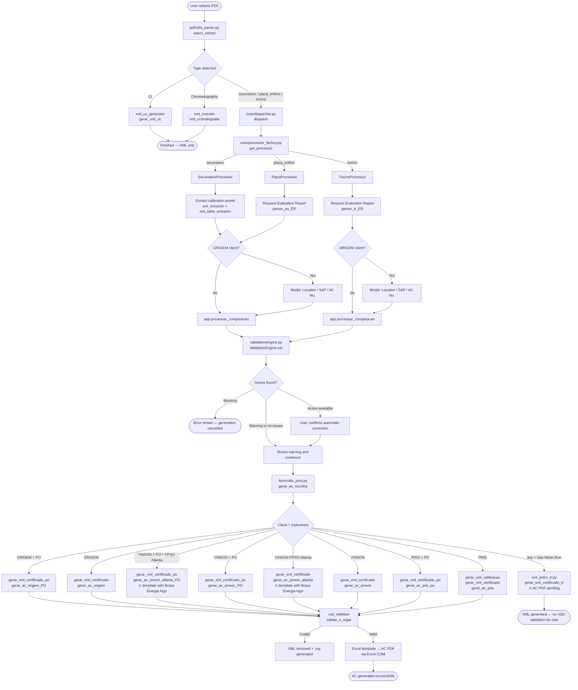
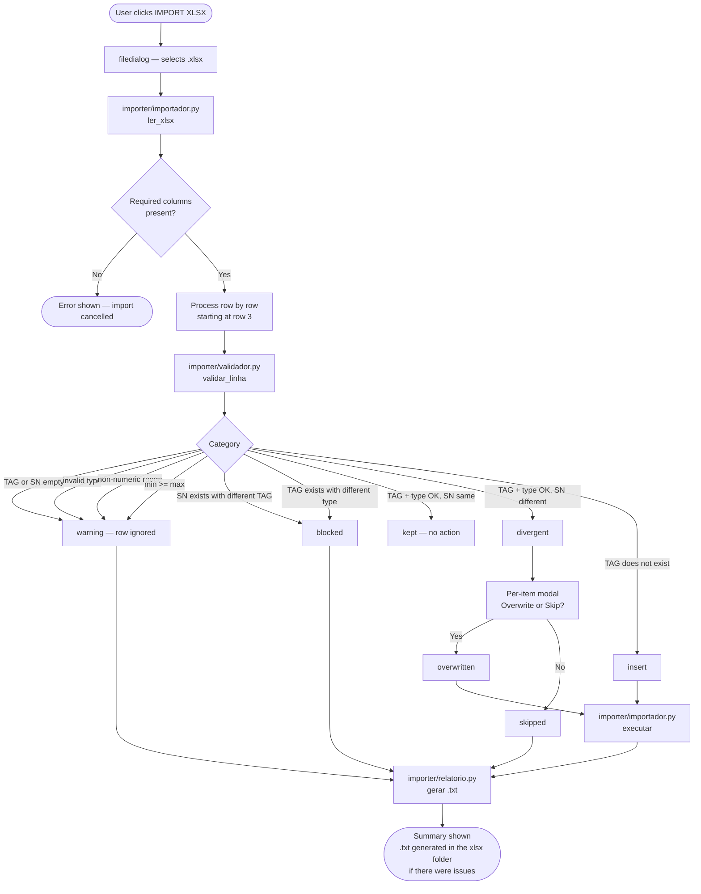
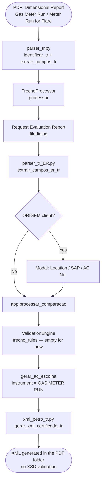
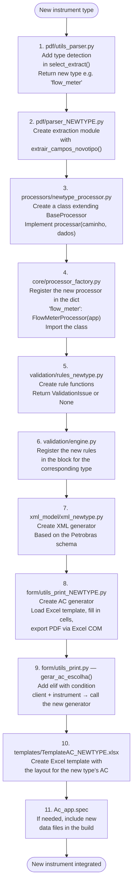
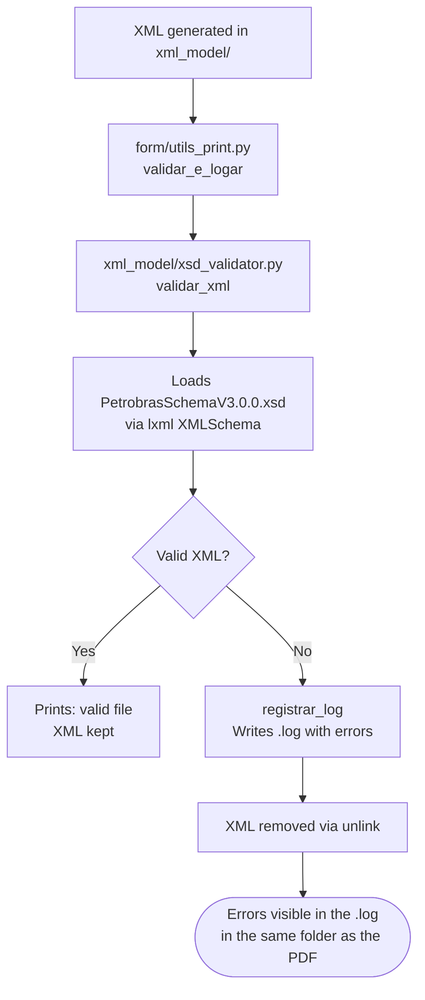

# AC's Generator — Project Documentation

## Overview

**AC's Generator** is a desktop (Windows) application that automates the generation of instrument calibration **Critical Analyses (ACs)** for clients such as PRIO, ORIGEM Energia, YINSON, and SBM. Starting from a calibration certificate PDF, the system extracts the data, validates the information against the database and the XSD schemas, and generates the final files (Petrobras XML + AC PDF).

---

## Folder Structure

```
AC's_app/
│
├── Ac_app.py                   # Entry point
│
├── core/                       # Orchestration
│   ├── dispatcher.py           # Routes type → processor
│   └── processor_factory.py    # Processor factory
│
├── gui/                        # Graphical interface (CustomTkinter)
│   └── interface.py            # Main window + flow logic
│
├── pdf/                        # Data extraction from PDFs
│   ├── utils_parser.py         # Certificate type detector
│   ├── parser_certificados.py  # Pressure/temperature parser
│   ├── parser_po.py            # Orifice plate parser
│   ├── parser_po_ER.py         # Evaluation report parser (PO)
│   ├── parser_tr.py            # Gas Meter Run / Meter Run for Flare parser (DIM report)
│   ├── parser_tr_ER.py         # Evaluation report parser (straight run)
│   ├── parser_UC.py            # Uncertainty (CI) report parser
│   └── parser_sgs.py           # SGS chromatography parser
│
├── processors/                 # Processing logic per type
│   ├── base_processor.py       # Abstract base class
│   ├── secundario_processor.py # PT / TT / DPT / TE instruments
│   ├── placa_processor.py      # Orifice plate
│   ├── trecho_processor.py     # Gas Meter Run / Straight Run
│   └── ci_processor.py         # Uncertainty (CI) report
│
├── validation/                 # Validation engine
│   ├── engine.py               # Rule orchestrator
│   ├── context.py              # Validation context data
│   ├── issue.py                # Occurrence class (warning/block)
│   ├── rules_sec.py            # Secondary instrument rules (13 rules)
│   └── rules_po.py              # Orifice plate rules (2 rules)
│
├── xml_model/                  # XML generation and validation
│   ├── xsd_validator.py        # Validation against the Petrobras schema
│   ├── PetrobrasSchemaV3.0.0.xsd
│   ├── xml_petro_generator.py  # Main Petrobras XML (helper functions)
│   ├── xml_generator.py        # Standard PRIO calibration XML
│   ├── xml_petro_po.py         # Orifice plate XML
│   ├── xml_petro_tr.py         # Gas Meter Run / Straight Run XML
│   ├── xml_uc_generator.py     # Uncertainty report XML
│   ├── xml_cromato.py          # Chromatography XML
│   ├── xml_extractor.py        # Extraction of calibration points from the PDF
│   ├── xml_extractor_PO.py     # Extraction of PO measurements
│   ├── xml_extractor_TR.py     # Extraction of DIM report tables (straight run)
│   └── xml_table_extractor.py  # Extraction of Petrobras tables
│
├── form/                       # AC PDF generation (Excel → PDF)
│   ├── utils_print.py          # Main router (gerar_ac_escolha)
│   ├── utils_print_ORIGEM.py
│   ├── utils_print_ORIGEM_PO.py
│   ├── utils_print_PRIO.py
│   ├── utils_print_PRIO_PO.py
│   ├── utils_print_YINSON.py
│   ├── utils_print_YINSON_ATLANTA.py
│   ├── utils_print_YINSON_PO.py
│   └── utils_print_YINSON_ATLANTA_PO.py
│
├── data/                       # SQLite database
│   ├── conexao.py               # Connection, criar_tabela(), migrar()
│   └── utils_db.py              # CRUD: secondary instruments and plates
│
├── importer/                   # Bulk import via xlsx
│   ├── __init__.py
│   ├── validador.py             # Per-row validation rules
│   ├── importador.py            # Orchestrates reading, validation, and writing to the database
│   └── relatorio.py             # Generates a .txt with blocked, ignored, and skipped rows
│
└── logo/                       # Image assets
```

---

## Main Flow — PDF → AC + XML



---

## Bulk Import Flow — xlsx → Database

Accessible via the **IMPORT XLSX** button on the "Edit Technical Data" screen.



### Per-row validation rules

| Category | Condition | Action |
|---|---|---|
| `aviso` (warning) | TAG or SN empty | Row ignored, logged in the .txt |
| `aviso` (warning) | `tipo` missing or different from `SEC`/`PO` | Row ignored, logged in the .txt |
| `aviso` (warning) | `min_range` or `max_range` non-numeric (SEC only) | Row ignored, logged in the .txt |
| `aviso` (warning) | `min_range >= max_range` (SEC only) | Row ignored, logged in the .txt |
| `bloqueado` (blocked) | TAG exists in the database with a different type | Not imported, logged in the .txt |
| `bloqueado` (blocked) | SN exists with a different TAG | Not imported, logged in the .txt |
| `mantido` (kept) | TAG + SN + type identical in the database | No action |
| `divergente` (divergent) | TAG + type match, SN different | Per-item confirmation modal |
| `inserir` (insert) | TAG does not exist in the database | Automatic insertion |

### Expected xlsx structure

| Column | Required | Notes |
|---|---|---|
| `tag` | ✅ | Instrument identifier |
| `sn_instrumento` | ✅ | Serial number |
| `tipo` | ✅ | `SEC` or `PO` |
| `sn_sensor` | ➖ | SEC only |
| `min_range` | ➖ | SEC only |
| `max_range` | ➖ | SEC only |

> Header on **row 1**, optional legend on **row 2**, data starting at **row 3**. A pre-formatted template is available as `template_importacao_instrumentos.xlsx` in the project root.

---

## Gas Meter Run Flow — DIM Report + Evaluation Report



### Supported DIM Report formats

| Format | Client | Standard | Detection |
|---|---|---|---|
| Gas Meter Run (PRIO/ORIGEM standard) | PRIO, ORIGEM Energia | AGA3-2 / ISO 5167 | `"Meter Run"` or `"Trecho Reto"` in the text |
| Meter Run for Flare Ultrasonic | SBM (Single Buoy Moorings INC.) | ISO 17089-2 | `"Meter Run for Flare"` → `meter_run_for_flare_ultrasonic` section |

### Extraction rules — parser_tr.py

| Field | Recognized pattern |
|---|---|
| System TAG | `Identification / identificação: TAG` or `Identification TAG/SN / Identificação TAG/NS: TAG / SN` |
| Client name | `Name / Nome: ... Contact / Contato:` (with or without spaces around the `/`) |
| Material | `Material of Pipe / ...: Carbon Steel` or `Material: Stainless Steel` |
| Standard | AGA3 → `AGA3-2:YEAR`; ISO 17089 → `ISO 17089-2:YEAR`; ISO 5167 → `ISO 5167-2:YEAR`; default `ISO 5167-2:2022` |
| Nominal diameter | `Nominal Diameter: 2"` → unit `"` ; `Diameter / Diâmetro: 742,2 mm` → unit `mm` |
| Measurement date | `Measurement Date: DD/MM/YYYY` or `Calibration Date: DD/MM/YYYY` |
| Procedure | Detects AGA 3 or ISO (`\d+`) in the measurement text |
| Flow conditioner | `Zanker TAG / SN: N/A` or `Não consta` (not present) → `"Nenhum"` (none); `19 tubos` (19 tubes) → `"19 tubos"` |
| Components (TAG/SN) | Orifice Carrier, Upstream/Downstream Pipe, Zanker/19-Tube Bundle; `N/A` as TAG → `"NI"`; completely absent → `tag="NI"`, `sn="NI"` |

### DIM Report extraction — xml_extractor_TR.py

The extractor reads the tables from the dimensional PDF and organizes the data by section:

| Detected section | Internal key | Extracted data |
|---|---|---|
| `Orifice Carrier` / `Porta Placa` | `porta_placa` | D diameters (except circularity and 2D/4D) |
| `Orifice Flange` / `Flange de Orifício` | `flange_de_orificio` | Internal diameter at 20°C |
| `Meter Run for Flare` / `Trecho Reto para Medidor` | `meter_run_for_flare_ultrasonic` | `Medium Internal Pipe Diameter (D) at 20°C` |

---

## How to Add a New Instrument



---

## XSD Validation Flow



> **Note:** The Gas Meter Run flow does not yet go through XSD validation — the XML is generated directly for testing.

### Schema enumerations (PetrobrasSchemaV3.0.0.xsd)

#### `t_lista_componente` — valid values for `<TIPO>` in `DEMAIS_COMPONENTES`

| Value in the XML | When to use |
|---|---|
| `PORTA PLACA` | Standard Orifice Carrier |
| `FLANGE DE ORIFICIO` | Orifice Flange (without Orifice Carrier) |
| `CONDICIONADOR DE FLUXO` | Zanker or 19-tube bundle |
| `TRECHO RETO PARA MEDIDOR DE FLARE ULTRASSÔNICO` | Meter Run for Flare Ultrasonic (SBM) |
| `TRECHO A MONTANTE 1` | Upstream Pipe 1 |
| `TRECHO A MONTANTE 2` | Upstream Pipe 2 |
| `TRECHO A JUSANTE` | Downstream Pipe |

#### `t_norma` — valid values for `<NORMA_AVALIACAO>`

| Value | Use |
|---|---|
| `AGA3-2:1991` / `AGA3-2:2000` / `AGA3-2:2016` | Gas Meter Run with the AGA standard |
| `ISO 5167-2:2022` | Standard Gas Meter Run (PRIO/ORIGEM) |
| `ABNT NBR ISO 5167-2:2022` | ABNT variant |
| `ISO 17089-2:2010` | Meter Run for Flare Ultrasonic (SBM) |

---

## Validation Rules — Secondary Instruments

| Rule | What it checks |
|---|---|
| `regra_tag_vs_sn` | Divergence between TAG and SN (MVS detection) |
| `regra_novo_instrumento` | Instrument not registered → offers automatic insertion |
| `regra_sn_instrumento` | Instrument SN differs from the registry |
| `regra_sn_sensor` | Sensor SN differs from the registry |
| `regra_range` | Calibration range differs from the registry |
| `regra_haste_te` | TE sensor stem validation |
| `regra_local_fpso` | Inconsistent FPSO location |
| `regra_rangein` | Indicated range vs. calibration range |
| `regra_incert_fidu` | Uncertainty / fiducial error out of limit |
| `regra_cmc` | CMC (Capability Measurement Capability) |
| `regra_classe` | Instrument class |
| `data_proxcal` | Next calibration date |
| `prazo_emissao` | Certificate issuance deadline |

---

## Supported Clients and Templates

| Client | Instrument | Excel Template | XML Generator | AC PDF |
|---|---|---|---|---|
| ORIGEM Energia Alagoas | Secondary | `TemplateAC_ORIGEM.xlsx` | `xml_petro_generator.py` | ✅ |
| ORIGEM Energia Alagoas | Orifice Plate | `TemplateAC_PO_ORIGEM.xlsx` | `xml_petro_po.py` | ✅ |
| PRIO | Secondary | `TemplateAC_PRIO.xlsx` | `xml_generator.py` + `xml_petro_generator.py` | ✅ |
| PRIO | Orifice Plate | `TemplateAC_PO_PRIO.xlsx` | `xml_petro_po.py` | ✅ |
| PRIO | Gas Meter Run | — | `xml_petro_tr.py` | ⏳ pending |
| YINSON | Secondary | `TemplateAC_YINSON.xlsx` | `xml_petro_generator.py` | ✅ |
| YINSON (FPSO Atlanta) | Secondary | `TemplateAC_YINSON - ATLANTA.xlsx` ¹ | `xml_petro_generator.py` | ✅ |
| YINSON | Orifice Plate | `TemplateAC_PO_YINSON.xlsx` | `xml_petro_po.py` | ✅ |
| YINSON (FPSO Atlanta) | Orifice Plate | `TemplateAC_PO_YINSON - ATLANTA.xlsx` ¹ | `xml_petro_po.py` | ✅ |
| SBM (Single Buoy Moorings INC.) | Gas Meter Run (Meter Run for Flare) | — | `xml_petro_tr.py` | ⏳ pending |

> ¹ The **FPSO Atlanta** templates include the **Brava Energia** logo, contractually required for instruments located on that unit. The router (`gerar_ac_escolha`) checks `"ATLANTA" in local` before dispatching to the standard YINSON template.

> Routing to Gas Meter Run is done **exclusively by instrument** (`instrumento == "GAS METER RUN"`), regardless of client — which allows support for any client that sends this type of report.

---

## Database — `instrumentos` Table

| Column | Type | Required | Description |
|---|---|---|---|
| `id` | INTEGER | ✅ | Auto-incrementing primary key |
| `tag` | TEXT | ✅ | Instrument identifier |
| `sn_instrumento` | TEXT | ✅ | Instrument or plate serial number |
| `sn_sensor` | TEXT | ➖ | Sensor serial number (SEC only) |
| `min_range` | REAL | ➖ | Minimum calibration range (SEC only) |
| `max_range` | REAL | ➖ | Maximum calibration range (SEC only) |
| `tipo` | TEXT | ✅ | `SEC` (secondary) or `PO` (orifice plate) |

The `migrar()` function in `data/conexao.py` is called on startup and automatically applies:
- Addition of the `tipo` column to databases created before this version
- Conversion of legacy values: `'secundario'` → `'SEC'` and `'placa_orificio'` → `'PO'`

---

## Known Behaviors / Limitations

### pdfplumber — column merging in multi-column PDFs

In certificates with a two-column side-by-side layout (e.g., TEM certificates), pdfplumber can merge the text of adjacent columns, producing strings like `Ca4lTibBrMat2iGon1 Range:` instead of `Calibration Range:`. `parser_certificados.py` has a fallback that anchors on the `Range: Min: X - Max: Y` pattern to work around this problem.

If a new certificate has missing fields (`"None"` in the XML), check the extracted text with:

```python
import pdfplumber
with pdfplumber.open("certificado.pdf") as pdf:
    for i, page in enumerate(pdf.pages):
        print(f"=== Page {i} ===")
        print(repr(page.extract_text()))
```

### CI number with REV suffix

The `parser_UC.py` parser recognizes the revision suffix in the CI number:

```
CI-1600.0000-6252-813-O2C-357_REV.01   ✅ recognized
CI-1600.0000-6252-813-O2C-357.REV.01   ✅ recognized
CI-1600.0000-6252-813-O2C-357          ✅ recognized (without REV)
```

### Missing components in the straight run

When `TAG / SN: Não consta` (i.e., "not present" — or `N/A`, `Not present`, `N/C`) appears with no valid SN following it, the component still shows up in the XML with `tag="NI"` and `sn="NI"` — **it is not omitted**. This forces manual review of the case instead of silently hiding the problem.

The distinction between `N/A / TR00434-01 M1` (TAG absent but SN present) and a plain `N/A` is made via lookahead: `(?!\s*/\s*[A-Z0-9])`.

---

## Main Dependencies

| Library | Use |
|---|---|
| `customtkinter` | Graphical interface |
| `openpyxl` | Reading and writing Excel templates |
| `win32com.client` | Excel → PDF export via COM |
| `lxml` | XML / XSD generation and validation |
| `pdfplumber` / `pymupdf` | Text and table extraction from PDF |
| `sqlite3` | Instrument database |
| `holidays` | Business day calculation |
| `PyInstaller` | Executable packaging |

---

## Future Architecture

The current interface (CustomTkinter) could be replaced by a modern web front-end without giving up local installation. The recommended approach:

1. **Backend**: expose the Python logic via **FastAPI** (local server, port `127.0.0.1:PORT`)
2. **Frontend**: any web technology (React, Vue, etc.) served as static files by FastAPI itself
3. **Desktop window**: **PyWebView** opens the frontend in a native window with no external browser
4. **Packaging**: PyInstaller bundles Python + FastAPI + static files into a single `.exe` installer

The user installs it normally; the "API" runs locally on their computer — no external server required.
